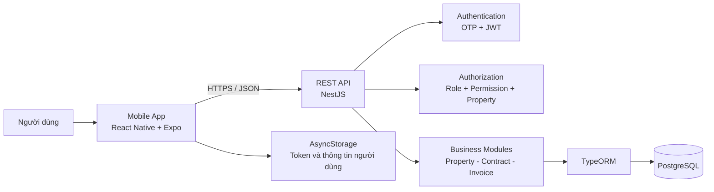
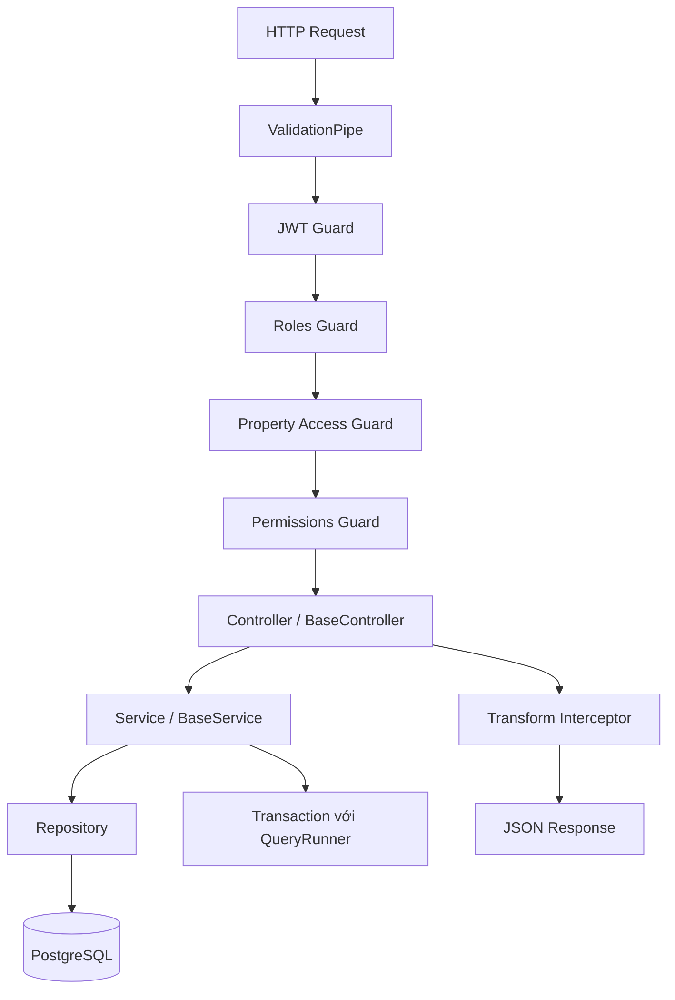
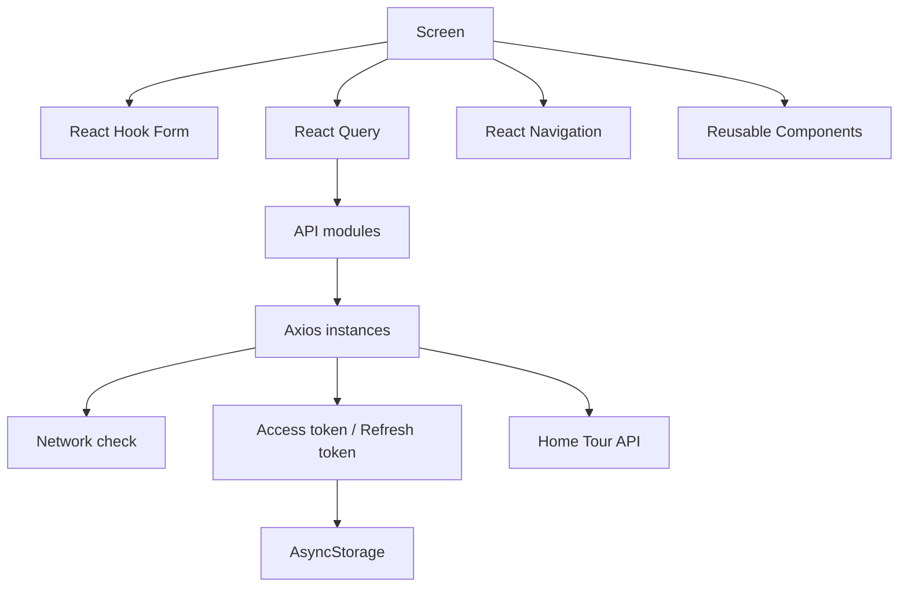
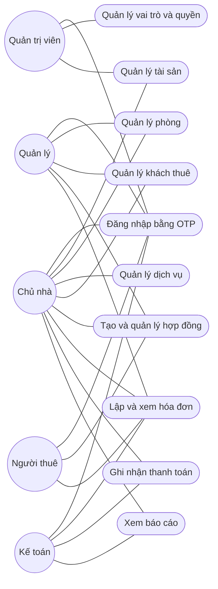
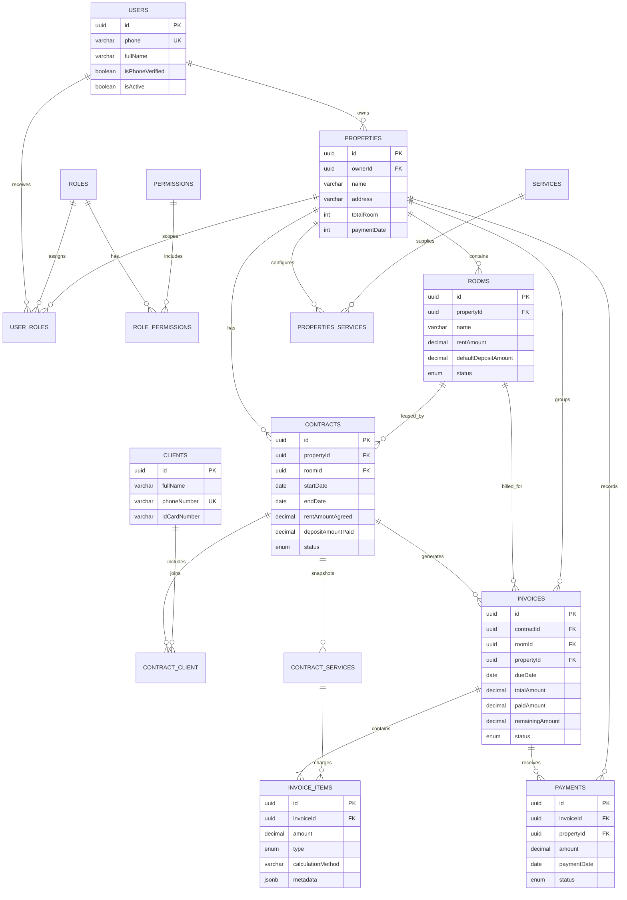
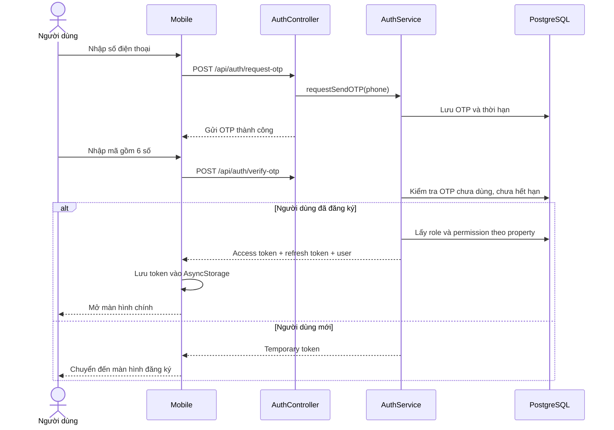
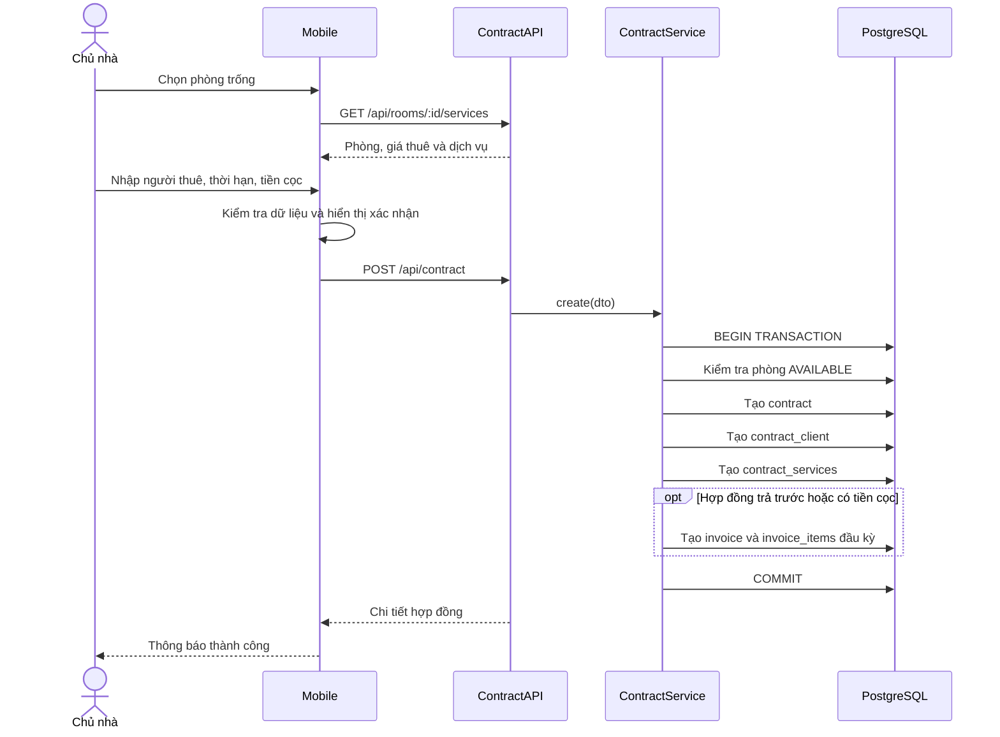
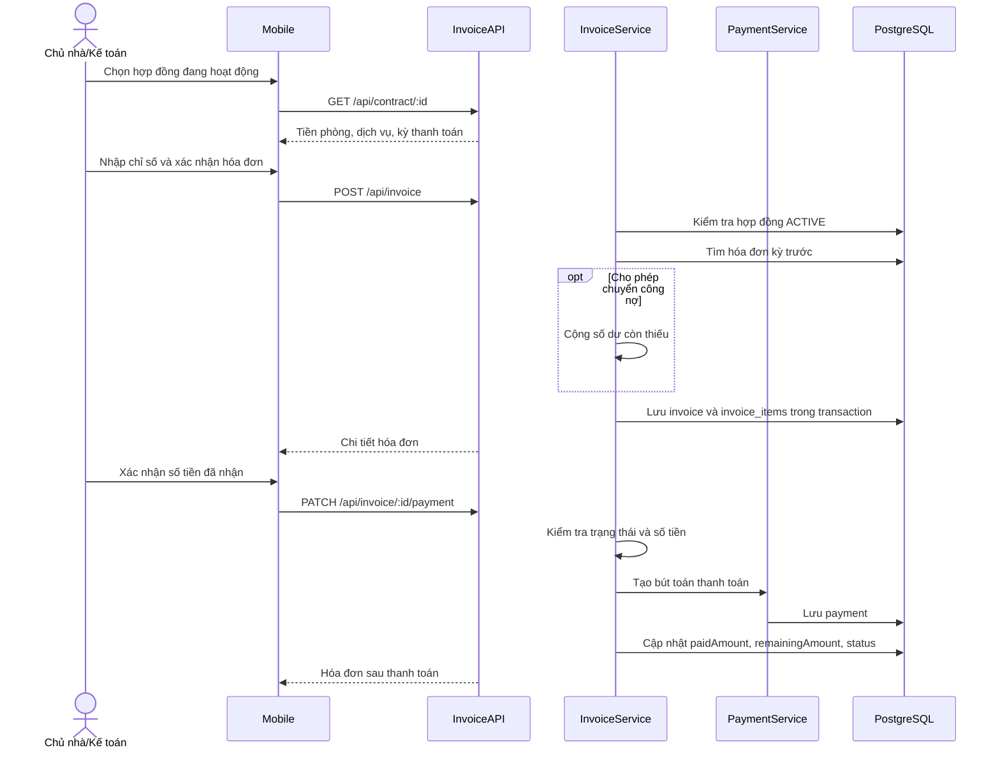
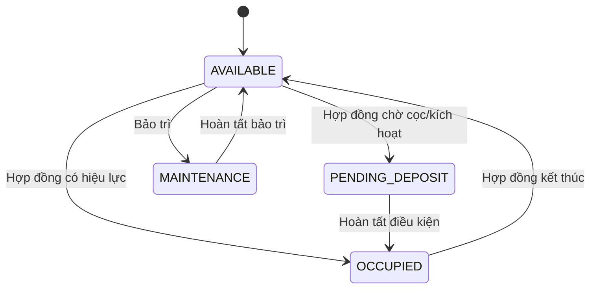
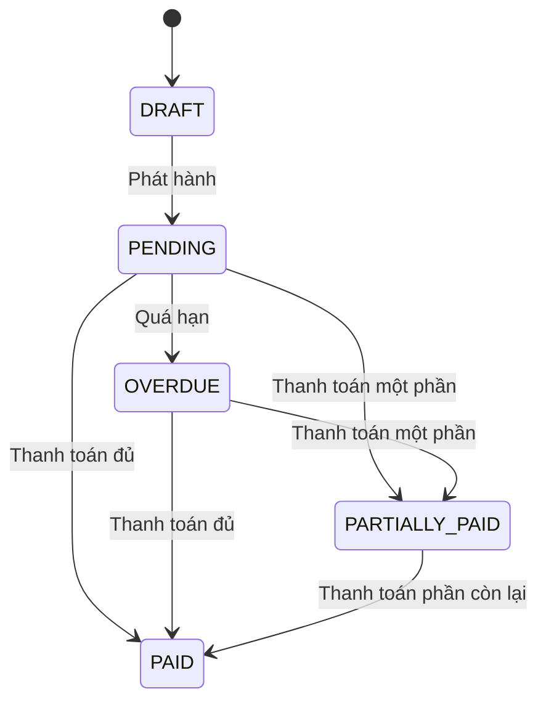

# BÁO CÁO ĐỒ ÁN: HỆ THỐNG QUẢN LÝ NHÀ TRỌ HOME TOUR

> **Phạm vi báo cáo:** Backend phiên bản 2 (`backend_v2`) và ứng dụng di động (`mobile`)
>
> **Loại sản phẩm:** Ứng dụng quản lý tài sản cho thuê và nhà trọ
>
> **Nền tảng:** NestJS, PostgreSQL, React Native và Expo

---

## Mục lục

1. [Giới thiệu đề tài](#1-giới-thiệu-đề-tài)
2. [Phân tích bài toán và giải pháp](#2-phân-tích-bài-toán-và-giải-pháp)
3. [Thiết kế hệ thống](#3-thiết-kế-hệ-thống)
4. [Cấu trúc thư mục dự án](#4-cấu-trúc-thư-mục-dự-án)
5. [Mô tả các chức năng chính](#5-mô-tả-các-chức-năng-chính)
6. [Một số đoạn mã quan trọng](#6-một-số-đoạn-mã-quan-trọng)
7. [Hướng dẫn cài đặt và chạy phần mềm](#7-hướng-dẫn-cài-đặt-và-chạy-phần-mềm)
8. [Kết luận và hướng phát triển](#8-kết-luận-và-hướng-phát-triển)

---

## 1. Giới thiệu đề tài

### 1.1. Bối cảnh

Việc quản lý nhà trọ theo phương pháp thủ công thường phụ thuộc vào sổ sách, bảng tính và các tin nhắn rời rạc. Khi số lượng tài sản và phòng tăng lên, người quản lý gặp khó khăn trong việc theo dõi tình trạng phòng, thông tin người thuê, thời hạn hợp đồng, dịch vụ sử dụng, hóa đơn và công nợ. Dữ liệu phân tán còn làm tăng nguy cơ nhầm lẫn khi tính tiền hoặc bỏ sót hóa đơn đến hạn.

Từ thực tế đó, **Home Tour** được xây dựng nhằm số hóa quy trình quản lý tài sản cho thuê trên một ứng dụng di động. Hệ thống tập trung dữ liệu tại máy chủ, cho phép người dùng thao tác thuận tiện trên điện thoại và tạo thành một chuỗi nghiệp vụ thống nhất từ tài sản, phòng, hợp đồng đến hóa đơn và thanh toán.

### 1.2. Mục tiêu

- Quản lý tập trung nhiều tài sản và các phòng thuộc từng tài sản.
- Theo dõi giá thuê, tiền cọc, hạn thanh toán và trạng thái phòng.
- Quản lý khách thuê chính, người ở cùng và thông tin hợp đồng.
- Cấu hình dịch vụ như điện, nước, Internet hoặc các khoản phí cố định.
- Lập hóa đơn theo kỳ, ghi nhận chỉ số dịch vụ và theo dõi công nợ.
- Ghi nhận thanh toán, hỗ trợ thanh toán một phần và xác định hóa đơn quá hạn.
- Xác thực người dùng bằng số điện thoại và OTP.
- Phân quyền theo vai trò và theo từng tài sản.
- Cung cấp giao diện di động trực quan, phù hợp với công việc quản lý hằng ngày.

### 1.3. Đối tượng sử dụng

| Đối tượng | Nhu cầu chính |
|---|---|
| Quản trị viên | Quản lý toàn bộ dữ liệu, vai trò và quyền hạn |
| Chủ nhà/chủ tài sản | Quản lý tài sản, phòng, hợp đồng, hóa đơn và doanh thu |
| Quản lý tài sản | Thực hiện nghiệp vụ trên tài sản được phân công |
| Kế toán | Theo dõi hóa đơn, công nợ và thanh toán |
| Người thuê | Xem các thông tin được cấp quyền liên quan đến hợp đồng và hóa đơn |

### 1.4. Phạm vi hiện tại

Báo cáo tập trung vào hai thành phần chính:

- **`backend_v2`:** REST API được xây dựng bằng NestJS, TypeORM và PostgreSQL.
- **`mobile`:** ứng dụng React Native chạy trên Expo, giao tiếp với backend qua Axios.

Các chức năng cốt lõi đã có mã nguồn gồm xác thực OTP, người dùng, tài sản, phòng, dịch vụ, khách thuê, hợp đồng, hóa đơn, thanh toán, tải tệp và RBAC. Phần báo cáo/thống kê trên mobile hiện có giao diện minh họa bằng dữ liệu mẫu; service báo cáo của backend chưa hoàn thiện.

---

## 2. Phân tích bài toán và giải pháp

### 2.1. Các vấn đề cần giải quyết

#### Dữ liệu tài sản và phòng thiếu đồng bộ

Mỗi tài sản có địa chỉ, số tầng, số phòng, ngày thu tiền và danh sách dịch vụ riêng. Mỗi phòng lại có giá thuê, tiền cọc, sức chứa và trạng thái khác nhau. Nếu quản lý riêng lẻ, người dùng khó có được cái nhìn tổng thể và dễ nhập thông tin không nhất quán.

#### Vòng đời hợp đồng phức tạp

Hợp đồng liên quan đồng thời đến tài sản, phòng, người thuê, dịch vụ, tiền thuê, tiền cọc, ngày bắt đầu, ngày kết thúc và phương thức trả trước/trả sau. Khi hợp đồng thay đổi trạng thái, trạng thái phòng cũng phải thay đổi tương ứng.

#### Tính hóa đơn và theo dõi công nợ

Một hóa đơn có thể gồm tiền phòng, tiền cọc và nhiều dịch vụ với cách tính khác nhau. Người thuê có thể thanh toán một phần; phần còn thiếu cần được giữ lại hoặc chuyển sang hóa đơn tiếp theo. Trạng thái hóa đơn phải phản ánh đúng số tiền đã thu và hạn thanh toán.

#### Kiểm soát truy cập

Một người dùng có thể là chủ sở hữu ở tài sản này nhưng chỉ là quản lý hoặc kế toán ở tài sản khác. Vì vậy, phân quyền chỉ dựa trên vai trò toàn hệ thống là chưa đủ; hệ thống cần giới hạn dữ liệu theo từng tài sản.

#### Trải nghiệm trên thiết bị di động

Người quản lý thường thao tác tại khu nhà trọ nên cần quy trình ngắn gọn, biểu mẫu có kiểm tra dữ liệu và khả năng tải ảnh/tài liệu từ điện thoại.

### 2.2. Giải pháp đề xuất và triển khai

| Bài toán | Giải pháp trong Home Tour |
|---|---|
| Dữ liệu phân tán | PostgreSQL lưu trữ tập trung; TypeORM mô hình hóa quan hệ |
| Nhiều nhóm nghiệp vụ | Backend chia theo module NestJS: property, contract, invoice, payment... |
| Lặp lại mã CRUD | `BaseController`, `BaseService` và repository dùng chung |
| Xác thực thuận tiện | OTP theo số điện thoại, JWT access token và refresh token |
| Phân quyền nhiều tài sản | RBAC gồm `UserRole(userId, roleId, propertyId)` và permission |
| Nghiệp vụ cần toàn vẹn | Transaction cho quá trình tạo hợp đồng và tạo hóa đơn |
| Công nợ nhiều kỳ | Liên kết `preInvoiceId` và tùy chọn `carryDebtToNextInvoice` |
| Mobile cần quản lý trạng thái server | React Query kết hợp lớp API Axios |
| Biểu mẫu phức tạp | React Hook Form, validation và màn hình xác nhận |
| Mạng không ổn định | Axios interceptor kiểm tra kết nối, timeout và làm mới token |

### 2.3. Yêu cầu chức năng

1. Người dùng nhập số điện thoại, xác thực OTP và đăng ký nếu chưa có tài khoản.
2. Chủ nhà tạo và cập nhật tài sản.
3. Người dùng quản lý danh sách phòng, giá thuê, tiền cọc và trạng thái.
4. Người dùng cấu hình dịch vụ cho từng tài sản.
5. Người dùng tạo hợp đồng cho phòng đang trống, thêm người thuê và dịch vụ.
6. Người dùng kích hoạt hoặc chấm dứt hợp đồng; hệ thống cập nhật trạng thái phòng.
7. Người dùng lập hóa đơn từ dữ liệu hợp đồng và dịch vụ.
8. Hệ thống tính tổng tiền, số tiền đã trả, số còn lại và trạng thái hóa đơn.
9. Người dùng xem lịch sử hóa đơn và ghi nhận thanh toán.
10. Hệ thống kiểm tra role, permission và quyền truy cập tài sản trước khi xử lý API.

### 2.4. Yêu cầu phi chức năng

- **Bảo mật:** JWT, refresh token có khả năng thu hồi, global guards và phân quyền RBAC.
- **Toàn vẹn dữ liệu:** khóa ngoại, unique constraint và transaction.
- **Khả năng bảo trì:** kiến trúc module, DTO, repository và lớp CRUD dùng chung.
- **Khả năng mở rộng:** mobile và backend tách biệt, giao tiếp qua REST API.
- **Tính đúng đắn:** `class-validator`, `ValidationPipe` và kiểu dữ liệu TypeScript.
- **Khả dụng:** thông báo lỗi, loading state, kiểm tra kết nối và timeout 10 giây.

---

## 3. Thiết kế hệ thống

### 3.1. Kiến trúc tổng thể



Mobile chịu trách nhiệm hiển thị, điều hướng và thu thập dữ liệu. Backend thực hiện xác thực, phân quyền, kiểm tra quy tắc nghiệp vụ và thao tác cơ sở dữ liệu. Cách tách này giúp một backend có thể phục vụ thêm web hoặc hệ thống quản trị trong tương lai.

### 3.2. Kiến trúc backend



Các guard được đăng ký toàn cục, vì vậy yêu cầu được kiểm tra theo thứ tự: danh tính, vai trò, quyền với tài sản và permission của chức năng. `TransformInterceptor` chuẩn hóa phản hồi; exception filter xử lý lỗi tập trung.

### 3.3. Kiến trúc mobile



Ứng dụng sử dụng stack navigator cho toàn bộ luồng và bottom tab cho các nhóm chức năng chính: Trang chủ, Tài sản, Phòng, Hợp đồng, Báo cáo và Cá nhân.

### 3.4. Use case tổng quát



### 3.5. ERD rút gọn

Sơ đồ dưới đây tập trung vào các bảng nghiệp vụ quan trọng nhất. Mọi entity chính còn kế thừa các trường dùng chung như `id`, `createdAt`, `updatedAt`, `createdBy` và `updatedBy`.



### 3.6. Sequence diagram đăng nhập OTP



### 3.7. Sequence diagram tạo hợp đồng



### 3.8. Sequence diagram lập hóa đơn và thanh toán



### 3.9. Trạng thái nghiệp vụ

#### Trạng thái phòng



#### Trạng thái hóa đơn



---

## 4. Cấu trúc thư mục dự án

```text
home-tour/
├── backend_v2/                     # Backend chính
│   ├── document/                   # Tài liệu nghiệp vụ và hướng dẫn API
│   ├── src/
│   │   ├── common/
│   │   │   ├── base/               # Base entity/controller/service/repository
│   │   │   ├── decorators/         # Decorator dùng chung
│   │   │   ├── enums/              # Enum trạng thái và nghiệp vụ
│   │   │   ├── filter/             # Global exception filter
│   │   │   ├── guards/             # Guard dùng chung
│   │   │   ├── interceptors/       # Chuẩn hóa request/response
│   │   │   └── utils/              # Hàm ngày tháng, số tiền, chuỗi
│   │   ├── config/                  # Cấu hình PostgreSQL
│   │   ├── database/migrations/     # TypeORM migrations
│   │   ├── modules/
│   │   │   ├── auth/               # OTP, JWT, token
│   │   │   ├── users/              # Người dùng hệ thống
│   │   │   ├── rbac/               # Role, permission, property access
│   │   │   ├── property/           # Tài sản, phòng, dịch vụ theo tài sản
│   │   │   ├── services/           # Danh mục dịch vụ
│   │   │   ├── client/             # Hồ sơ khách thuê
│   │   │   ├── contract/           # Hợp đồng và lịch sử thay đổi
│   │   │   ├── invoice/            # Hóa đơn và chi tiết hóa đơn
│   │   │   ├── payment/            # Bút toán thanh toán
│   │   │   ├── location/           # Tỉnh, huyện, xã
│   │   │   ├── upload.file/        # Tệp và bộ sưu tập tệp
│   │   │   └── report/             # Báo cáo (đang phát triển)
│   │   ├── app.module.ts            # Đăng ký module và database
│   │   └── main.ts                  # Bootstrap, guards, Swagger
│   ├── test/                        # Kiểm thử end-to-end
│   └── package.json
│
├── mobile/                          # Ứng dụng React Native
│   ├── assets/                      # Icon, splash và tài nguyên tĩnh
│   ├── src/
│   │   ├── api/                     # API theo từng module nghiệp vụ
│   │   ├── components/              # Component giao diện tái sử dụng
│   │   ├── constant/                # Hằng số ứng dụng
│   │   ├── navigation/              # Bottom tabs và định nghĩa route
│   │   ├── screens/
│   │   │   ├── auth/                # Đăng nhập, OTP, đăng ký
│   │   │   ├── dashboard/           # Trang chủ
│   │   │   ├── property/            # Danh sách và chi tiết tài sản
│   │   │   ├── room/                # Danh sách và chi tiết phòng
│   │   │   ├── tenant/              # Quản lý khách thuê
│   │   │   ├── contract/            # Tạo, xem và kết thúc hợp đồng
│   │   │   ├── invoice/             # Tạo, xem, thanh toán hóa đơn
│   │   │   ├── report/              # Giao diện báo cáo
│   │   │   └── profile/             # Thông tin cá nhân
│   │   ├── services/api/            # Axios và interceptor
│   │   ├── types/                   # Kiểu request/response
│   │   ├── utils/                   # Storage, ngày tháng, định dạng
│   │   └── config.ts                # Địa chỉ backend
│   ├── App.tsx                      # Root navigator và providers
│   ├── app.json                     # Cấu hình Expo
│   └── package.json
└── README.md                        # Tài liệu báo cáo
```

---

## 5. Mô tả các chức năng chính

> Các vị trí bên dưới là gợi ý để bổ sung ảnh chụp màn hình vào báo cáo.

### 5.1. Xác thực OTP

Người dùng đăng nhập bằng số điện thoại thay vì mật khẩu. Sau khi nhập số điện thoại, ứng dụng gọi API yêu cầu OTP. Người dùng nhập mã gồm sáu chữ số; mã chỉ hợp lệ khi chưa được sử dụng và chưa hết hạn. Nếu số điện thoại chưa đăng ký, backend cấp temporary token để hoàn tất hồ sơ. Nếu đã đăng ký, backend trả access token, refresh token và thông tin người dùng.

**Điểm nổi bật:**

- Chuẩn hóa số điện thoại về đầu số `+84`.
- OTP có thời gian hiệu lực ngắn.
- Access token chứa danh sách tài sản, role và permission của người dùng.
- Refresh token cũ bị thu hồi khi làm mới token.
- Mobile tự lưu token và tự thử refresh khi API trả về `401`.

> **[Chèn Hình 1: Màn hình nhập số điện thoại]**
>
> **[Chèn Hình 2: Màn hình xác thực OTP]**

### 5.2. Quản lý tài sản

Người dùng có thể tạo, xem danh sách, xem chi tiết và cập nhật tài sản. Thông tin gồm tên, địa chỉ, tỉnh/huyện/xã, tọa độ, số tầng, tổng số phòng, giá thuê mặc định và ngày thanh toán. Một tài sản thuộc một chủ sở hữu và có nhiều phòng, dịch vụ.

Danh sách tài sản hỗ trợ phân trang, tìm kiếm và điều hướng sang chi tiết. Tài sản cũng là phạm vi dữ liệu được dùng trong cơ chế RBAC.

> **[Chèn Hình 3: Danh sách tài sản]**
>
> **[Chèn Hình 4: Biểu mẫu tạo hoặc cập nhật tài sản]**

### 5.3. Quản lý phòng

Mỗi phòng thuộc một tài sản và có các thuộc tính: tên phòng, tầng, diện tích, sức chứa tối đa, giá thuê, tiền cọc mặc định, ngày thu tiền, hình ảnh và trạng thái.

Các trạng thái phòng giúp phản ánh tình hình khai thác thực tế, ví dụ phòng trống, đang chờ cọc, đã có người thuê hoặc đang bảo trì. Ứng dụng cho phép lọc phòng theo tài sản và mở quy trình tạo hợp đồng trực tiếp từ phòng trống.

> **[Chèn Hình 5: Danh sách phòng và bộ lọc tài sản]**
>
> **[Chèn Hình 6: Màn hình chi tiết phòng]**

### 5.4. Quản lý dịch vụ

Hệ thống có danh mục dịch vụ dùng chung và cấu hình dịch vụ theo từng tài sản. Khi tạo hợp đồng, cấu hình cần thiết được sao chép sang `contract_services` để giữ đúng mức giá tại thời điểm ký.

Một số cách tính được hỗ trợ:

- Miễn phí.
- Phí cố định theo phòng.
- Phí theo số lượng/người.
- Phí theo chỉ số sử dụng, phù hợp với điện và nước.

### 5.5. Quản lý khách thuê và hợp đồng

Quy trình tạo hợp đồng bắt đầu từ một phòng đang ở trạng thái `AVAILABLE`. Mobile tự lấy giá thuê, tiền cọc, hạn thanh toán và dịch vụ mặc định của phòng. Người dùng nhập:

- Người thuê chính và số điện thoại.
- Danh sách người ở cùng.
- Ngày bắt đầu, ngày kết thúc.
- Giá thuê thỏa thuận và tiền cọc đã nhận.
- Hình thức trả trước hoặc trả sau.
- Danh sách dịch vụ và cách tính.
- Ghi chú hợp đồng.

Trước khi gửi API, ứng dụng kiểm tra ngày kết thúc phải lớn hơn ngày bắt đầu và hiển thị màn hình xác nhận. Backend tiếp tục kiểm tra phòng tồn tại, phòng còn trống, chưa có hợp đồng active và có ít nhất một người thuê chính. Toàn bộ việc tạo hợp đồng, khách thuê, dịch vụ và hóa đơn đầu kỳ được đặt trong transaction.

Hệ thống cũng lưu lịch sử đổi trạng thái hợp đồng và lý do thay đổi để hỗ trợ truy vết nghiệp vụ.

> **[Chèn Hình 7: Danh sách hợp đồng]**
>
> **[Chèn Hình 8: Biểu mẫu tạo hợp đồng]**
>
> **[Chèn Hình 9: Màn hình xác nhận và chi tiết hợp đồng]**

### 5.6. Lập và quản lý hóa đơn

Hóa đơn được tạo cho hợp đồng đang hoạt động. Mobile khởi tạo các dòng tiền phòng và dịch vụ từ hợp đồng, sau đó cho phép người dùng điều chỉnh kỳ thanh toán, hạn thanh toán, chỉ số dịch vụ và ghi chú.

Mỗi hóa đơn lưu:

- Hợp đồng, phòng và tài sản liên quan.
- Kỳ tính tiền và hạn thanh toán.
- Tổng tiền, đã thanh toán và còn lại.
- Trạng thái hóa đơn.
- Danh sách `invoice_items`.
- Hóa đơn kỳ trước nếu có.

Nếu hợp đồng bật `carryDebtToNextInvoice`, backend có thể cộng phần còn thiếu của hóa đơn trước vào hóa đơn mới và tạo một dòng chi tiết có metadata `CARRY_OVER_DEBT`. Điều này giúp theo dõi công nợ mà không làm mất liên kết giữa các kỳ.

> **[Chèn Hình 10: Màn hình tạo hóa đơn]**
>
> **[Chèn Hình 11: Chi tiết hóa đơn và các khoản phí]**
>
> **[Chèn Hình 12: Lịch sử hóa đơn]**

### 5.7. Ghi nhận thanh toán

Từ chi tiết hóa đơn, người dùng nhập số tiền nhận, ngày thanh toán, phương thức và ghi chú. Số tiền phải lớn hơn 0 và không vượt quá số còn lại.

Backend cập nhật hóa đơn và tạo một bản ghi payment. Trạng thái được xác định theo quy tắc:

- `PAID` nếu số tiền còn lại bằng 0.
- `PARTIALLY_PAID` nếu đã trả một phần.
- `OVERDUE` nếu chưa trả và đã qua cuối ngày đến hạn.
- `PENDING` nếu chưa trả nhưng vẫn còn hạn.

Bản ghi payment đã tạo không được sửa hoặc xóa trực tiếp nhằm bảo đảm tính nhất quán của lịch sử tài chính; nếu có sai lệch nên tạo bút toán điều chỉnh.

> **[Chèn Hình 13: Bottom sheet xác nhận thanh toán]**

### 5.8. Tải ảnh và tệp đính kèm

Mobile sử dụng Expo Image Picker, Document Picker và Camera để chọn hoặc ghi nhận tài liệu. Backend quản lý `file_collections` và `file_entries`, cho phép nhóm nhiều tệp theo đối tượng nghiệp vụ. Chức năng này phù hợp để lưu ảnh phòng, giấy tờ hoặc bản chụp hợp đồng.

### 5.9. Báo cáo và thống kê

Màn hình báo cáo đã thiết kế các tab tổng quan, tòa nhà, người thuê và phân tích. Giao diện có card thống kê, tỷ lệ lấp đầy và biểu đồ doanh thu. Tuy nhiên, dữ liệu hiện tại vẫn là dữ liệu mẫu và `ReportService` phía backend chưa triển khai. Vì vậy đây là giao diện prototype, chưa phải báo cáo thời gian thực.

> **[Chèn Hình 14: Màn hình báo cáo và biểu đồ]**

### 5.10. Trạng thái hoàn thiện

| Nhóm chức năng | Trạng thái |
|---|---|
| Xác thực OTP, JWT, refresh token | Đã có luồng backend và mobile |
| Tài sản, phòng, dịch vụ | Đã có API và giao diện chính |
| Khách thuê, hợp đồng | Đã có luồng tạo/xem/kích hoạt/chấm dứt; cập nhật tổng quát còn hạn chế |
| Hóa đơn | Đã có tạo, xem, danh sách và xử lý công nợ |
| Thanh toán | Logic thanh toán qua hóa đơn đã có; một số API payment trực tiếp còn chưa triển khai |
| Upload tệp | Đã có module và thành phần mobile |
| Dashboard | Có giao diện, số liệu tổng quan còn tĩnh |
| Báo cáo | Prototype dùng mock data; backend đang phát triển |

---

## 6. Một số đoạn mã quan trọng

### 6.1. Đăng ký guard toàn cục

```typescript
const reflector = app.get(Reflector);
app.useGlobalGuards(new StickAuthGaurd(jwtService, reflector));
app.useGlobalGuards(new RolesGuard(reflector));
app.useGlobalGuards(new PropertyAccessGuard(reflector));
app.useGlobalGuards(
  new PermissionsGuard(reflector, permissionTreeService),
);
```

Đoạn mã đặt chuỗi bảo vệ ở cấp toàn ứng dụng. JWT guard xác định người dùng; role guard kiểm tra vai trò; property guard giới hạn truy cập theo tài sản; permission guard kiểm tra quyền cụ thể. Việc khai báo toàn cục giảm nguy cơ một controller mới vô tình bỏ qua bảo mật.

### 6.2. Sinh JWT chứa phạm vi quyền

```typescript
const userProperties =
  await this.rbacService.generateUserProperties(userId);

const accessTokenPayload = {
  sub: userId,
  phoneNumber,
  properties: userProperties,
  iat: Math.floor(Date.now() / 1000),
};

const accessToken = this.jwtService.sign(accessTokenPayload, {
  secret: process.env.JWT_SECRET,
  expiresIn: '120m',
});
```

Access token không chỉ xác định người dùng mà còn mang theo danh sách role và permission theo từng property. Nhờ đó backend có đủ thông tin để kiểm tra quyền truy cập trong kiến trúc nhiều tài sản.

### 6.3. Transaction khi tạo hợp đồng

```typescript
const queryRunner = this.dataSource.createQueryRunner();
await queryRunner.connect();
await queryRunner.startTransaction();

try {
  const savedContract = await queryRunner.manager.save(
    Contracts,
    contractEntity,
  );

  await this.createContractClient(
    savedContract.id,
    createDto.contractClient,
    savedContract,
    queryRunner.manager,
  );

  await this.createContractServices(
    savedContract.id,
    createDto.contractServices,
    savedContract,
    queryRunner.manager,
  );

  await queryRunner.commitTransaction();
} catch (error) {
  await queryRunner.rollbackTransaction();
  throw error;
} finally {
  await queryRunner.release();
}
```

Một hợp đồng không chỉ gồm một bản ghi mà còn có người thuê và dịch vụ. Transaction bảo đảm hoặc tất cả dữ liệu được tạo thành công, hoặc toàn bộ thay đổi bị hoàn tác. Điều này tránh tình trạng có hợp đồng nhưng thiếu người thuê hoặc thiếu dịch vụ.

### 6.4. Chuyển công nợ sang hóa đơn kế tiếp

```typescript
const preInvoiceRemaining = Number(findPreInvoice.remainingAmount);
const preInvoiceHasDebt =
  DEBT_INVOICE_STATUSES.includes(findPreInvoice.status) &&
  preInvoiceRemaining > 0;

if (findContract.carryDebtToNextInvoice && preInvoiceHasDebt) {
  entity.totalAmount += preInvoiceRemaining;
  entity.remainingAmount += preInvoiceRemaining;

  const debtItem = new InvoiceItem();
  debtItem.amount = preInvoiceRemaining;
  debtItem.type = InvoiceItemType.OTHER;
  debtItem.metadata = {
    reason: 'CARRY_OVER_DEBT',
    preInvoiceId: findPreInvoice.id,
  };
  entity.invoiceItems.push(debtItem);
}
```

Logic kiểm tra hóa đơn trước còn nợ và hợp đồng cho phép cộng dồn. Khoản nợ được thêm vào tổng tiền và lưu thành một dòng riêng, kèm ID hóa đơn nguồn. Cách làm này giúp người dùng nhìn thấy nguyên nhân của khoản tăng thay vì chỉ thay đổi tổng tiền.

### 6.5. Xác định trạng thái hóa đơn

```typescript
export function resolveInvoiceStatus({
  paidAmount,
  remainingAmount,
  dueDate,
  now = new Date(),
}: ResolveInvoiceStatusParams): InvoiceStatus {
  if (remainingAmount <= 0) {
    return InvoiceStatus.PAID;
  }

  if (paidAmount > 0) {
    return InvoiceStatus.PARTIALLY_PAID;
  }

  const endOfDueDate = new Date(dueDate);
  endOfDueDate.setHours(23, 59, 59, 999);

  return now.getTime() > endOfDueDate.getTime()
    ? InvoiceStatus.OVERDUE
    : InvoiceStatus.PENDING;
}
```

Hàm được tách thành pure function, không phụ thuộc database nên dễ kiểm thử. Việc so sánh với cuối ngày đến hạn tránh đánh dấu quá hạn ngay từ đầu ngày.

### 6.6. Axios interceptor tự làm mới token

```typescript
if (error.response?.status === 401 && !originalRequest._retry) {
  originalRequest._retry = true;

  const refreshToken = await storage.getRefreshToken();
  const response = await publicApi.post('/auth/refresh-token', {
    refreshToken,
  });

  await storage.setAccessToken(response.data.data.accessToken);
  await storage.setRefreshToken(response.data.data.refreshToken);

  originalRequest.headers.Authorization =
    createAuthorizationHeader(response.data.data.accessToken);
  return privateApi(originalRequest);
}
```

Khi access token hết hạn, request chỉ được thử lại một lần. Mobile dùng refresh token để lấy cặp token mới, lưu vào AsyncStorage và gửi lại request ban đầu. Cờ `_retry` ngăn vòng lặp vô hạn khi refresh cũng thất bại.

### 6.7. Khởi tạo biểu mẫu hợp đồng từ dữ liệu phòng

```typescript
const roomServiceResponse = await getRoomWitcService(roomId);
const room = roomServiceResponse.data;

reset({
  roomId: room.id,
  propertyId: room.propertyId,
  rentAmountAgreed: room.rentAmount,
  depositAmountPaid: room.defaultDepositAmount,
  paymentDueDay: room.defaultPaymentDueDay,
  contractClient: [],
  contractServices: room.contractServices,
});
```

Mobile tái sử dụng cấu hình của phòng để điền sẵn biểu mẫu. Người dùng không phải nhập lại giá thuê, tiền cọc, ngày thu tiền và dịch vụ, qua đó giảm thao tác và hạn chế sai lệch dữ liệu.

---

## 7. Hướng dẫn cài đặt và chạy phần mềm

### 7.1. Yêu cầu môi trường

- Git.
- Node.js từ phiên bản 20.11 trở lên.
- npm.
- PostgreSQL từ phiên bản 14 trở lên.
- Expo Go trên điện thoại, hoặc Android Studio/Xcode nếu dùng máy ảo.

### 7.2. Tải mã nguồn

```bash
git clone <repository-url>
cd home-tour
```

### 7.3. Cài đặt PostgreSQL

Tạo cơ sở dữ liệu và tài khoản phù hợp với môi trường cá nhân. Ví dụ:

```sql
CREATE DATABASE home_tour_v2;
CREATE USER home_tour_user WITH PASSWORD 'your_password';
GRANT ALL PRIVILEGES ON DATABASE home_tour_v2 TO home_tour_user;
```

### 7.4. Cài đặt backend

```bash
cd backend_v2
npm install
cp .env.example .env
```

Chỉnh sửa `.env`:

```env
NODE_ENV=development
PORT=3000

DB_TYPE=postgres
DB_HOST=localhost
DB_PORT=5432
DB_USERNAME=home_tour_user
DB_PASSWORD=your_password
DB_DATABASE=home_tour_v2

JWT_TEMP_SECRET=replace_with_a_strong_random_secret
JWT_SECRET=replace_with_a_strong_random_secret
JWT_REFRESH_SECRET=replace_with_a_strong_random_secret
```

Không đưa file `.env` và các secret thật lên Git.

Cấu hình hiện tại của backend đặt `synchronize: false`, do đó cần chạy migration đã có:

```bash
npm run migration:run
```

Khởi chạy development server:

```bash
npm run start:dev
```

Các địa chỉ mặc định:

- API: `http://localhost:3000`
- Swagger: `http://localhost:3000/api`

### 7.5. Cài đặt mobile

Mở terminal khác:

```bash
cd mobile
npm install
```

Kiểm tra `src/config.ts`:

```typescript
export const API_URL = 'http://localhost:3000';
export const PREFIX_URL = '/api';
```

Quy tắc chọn địa chỉ backend:

- **iOS Simulator:** thường có thể dùng `http://localhost:3000`.
- **Android Emulator:** thường dùng `http://10.0.2.2:3000`.
- **Điện thoại thật:** dùng IP LAN của máy chạy backend, ví dụ `http://192.168.1.10:3000`. Điện thoại và máy tính phải cùng mạng.

Khởi chạy Expo:

```bash
npm run start
```

Hoặc chạy trực tiếp theo nền tảng:

```bash
npm run android
npm run ios
npm run web
```

### 7.6. Build ứng dụng

Ứng dụng đã có cấu hình EAS:

```bash
npm run build:android
npm run build:ios
npm run build:preview
npm run build:production
```

Các lệnh này yêu cầu đăng nhập tài khoản Expo/EAS và cấu hình chứng chỉ tương ứng.

### 7.7. Kiểm thử backend

```bash
cd backend_v2

# Unit test
npm run test

# End-to-end test
npm run test:e2e

# Coverage
npm run test:cov

# Build kiểm tra TypeScript
npm run build
```

### 7.8. Quy trình chạy thử đề xuất

1. Khởi động PostgreSQL.
2. Chạy backend và mở Swagger để kiểm tra API.
3. Chạy Expo, cập nhật đúng địa chỉ backend.
4. Đăng nhập bằng số điện thoại và OTP.
5. Tạo tài sản, cấu hình phòng và dịch vụ.
6. Chọn phòng trống để tạo hợp đồng.
7. Kích hoạt hợp đồng và lập hóa đơn.
8. Mở chi tiết hóa đơn để kiểm tra hoặc ghi nhận thanh toán.

> Trong môi trường phát triển hiện tại, OTP được sinh và lưu ở database; dự án chưa tích hợp nhà cung cấp SMS thực tế. Có thể đọc bản ghi OTP trong database khi chạy thử nội bộ.

---

## 8. Kết luận và hướng phát triển

### 8.1. Kết luận

Home Tour đã xây dựng được nền tảng cho một hệ thống quản lý nhà trọ theo hướng module hóa và có khả năng mở rộng. Backend NestJS đảm nhiệm tốt việc tổ chức nghiệp vụ, lưu trữ quan hệ bằng PostgreSQL, xác thực JWT và phân quyền theo tài sản. Ứng dụng React Native cung cấp các luồng chính trên thiết bị di động, từ quản lý tài sản, phòng và hợp đồng đến lập hóa đơn.

Điểm quan trọng nhất của đồ án là mô hình dữ liệu liên kết xuyên suốt chuỗi nghiệp vụ:

```text
Tài sản → Phòng → Hợp đồng → Hóa đơn → Thanh toán
```

Việc sử dụng transaction trong các thao tác nhiều bước, tách dòng chi tiết hóa đơn và hỗ trợ chuyển công nợ cho thấy hệ thống đã quan tâm đến tính đúng đắn của dữ liệu nghiệp vụ, không chỉ dừng ở giao diện CRUD cơ bản.

Tuy vậy, dự án vẫn đang trong quá trình hoàn thiện. Dashboard và báo cáo chưa dùng dữ liệu thật; một số API cập nhật hợp đồng, payment trực tiếp và bộ kiểm thử chưa bao phủ đầy đủ các tình huống.

### 8.2. Hướng phát triển

#### Hoàn thiện nghiệp vụ

- Hoàn thiện cập nhật, gia hạn và chấm dứt hợp đồng theo một state machine thống nhất.
- Tự động kích hoạt hợp đồng và cập nhật trạng thái phòng khi đến ngày bắt đầu.
- Tạo hóa đơn định kỳ bằng scheduler/queue.
- Hoàn thiện API thanh toán, bút toán điều chỉnh và đối soát.
- Thêm quản lý chi phí vận hành và hoàn trả tiền cọc.

#### Báo cáo và thông báo

- Thay dữ liệu mock bằng API tổng hợp doanh thu, công nợ và tỷ lệ lấp đầy.
- Xuất báo cáo PDF hoặc Excel.
- Gửi thông báo hóa đơn sắp đến hạn và hợp đồng sắp hết hạn.
- Tích hợp push notification, email hoặc SMS.

#### Bảo mật

- Tích hợp nhà cung cấp OTP/SMS thực tế, giới hạn số lần yêu cầu và chống brute force.
- Mã hóa hoặc quản lý secret bằng secret manager.
- Rút ngắn và thống nhất thời hạn token; bổ sung rotation và theo dõi thiết bị.
- Thêm audit log đầy đủ cho các thao tác tài chính và thay đổi hợp đồng.

#### Chất lượng phần mềm

  
#### Trải nghiệm người dùng

- Bổ sung dashboard thời gian thực.
- Hỗ trợ dark mode, đa ngôn ngữ và accessibility.
- Tạo QR thanh toán và tích hợp cổng thanh toán/ngân hàng.
- Cho phép người thuê có giao diện riêng để xem hợp đồng, hóa đơn và lịch sử thanh toán.

---

## Phụ lục: Công nghệ sử dụng

| Thành phần | Công nghệ |
|---|---|
| Backend framework | NestJS 10, TypeScript |
| ORM và database | TypeORM 0.3, PostgreSQL |
| Authentication | Passport JWT, OTP, access/refresh token |
| API documentation | Swagger/OpenAPI |
| Validation | class-validator, class-transformer |
| Mobile | React Native 0.81, React 19, Expo 54 |
| Navigation | React Navigation 7 |
| Data fetching | Axios, TanStack React Query |
| Form | React Hook Form |
| Local storage | AsyncStorage |
| UI | NativeWind, React Native components |
| Build mobile | Expo Application Services (EAS) |

---

**Home Tour** là đồ án hướng đến việc áp dụng kiến thức phát triển ứng dụng di động, xây dựng REST API, thiết kế cơ sở dữ liệu và xử lý nghiệp vụ thực tế trong cùng một sản phẩm.
