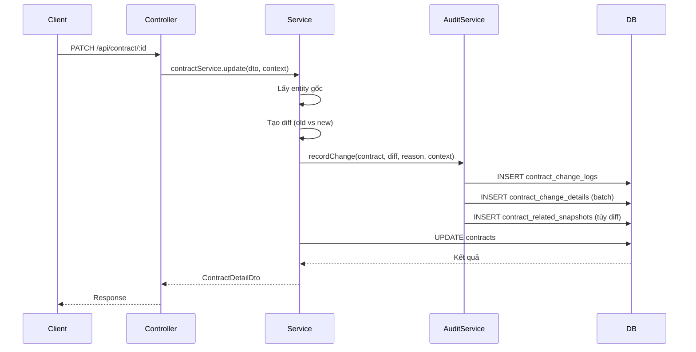

# README – Thiết Kế Lịch Sử Thay Đổi Cho Module Contract

Tài liệu này mô tả thiết kế mở rộng cho module `contract` nhằm lưu vết đầy đủ mỗi lần hợp đồng được cập nhật. Mục tiêu: bảo đảm truy vết (traceability), cung cấp lý do thay đổi, và hỗ trợ rà soát/audit sau này.

---

## 1. Mục tiêu và phạm vi
- Ghi lại toàn bộ thay đổi trên bảng `contracts` và các bảng phụ liên quan trực tiếp (clients, services, trạng thái phòng).
- Lưu lý do thay đổi do người dùng nhập.
- Theo dõi thông tin tác nhân (ai thực hiện, thông tin phiên đăng nhập).
- Hoàn tác logic (không rollback dữ liệu chính) nhưng đủ dữ liệu để khôi phục thủ công hoặc tái hiện.

Không bao gồm: versioning danh sách file đính kèm, log truy vấn đọc, hay ủy quyền phức tạp ngoài cơ chế RBAC hiện có.

---

## 2. Thiết kế database

### 2.1 Bảng `contract_change_logs`

| Cột | Kiểu | Ghi chú |
| --- | --- | --- |
| `id` | uuid | Khóa chính. |
| `contract_id` | uuid | FK → `contracts.id` (cascade on delete). |
| `actor_id` | uuid | FK → `users.id`, cho biết ai thực hiện. |
| `actor_role` | enum(Role) | Ghi nhận vai trò tại thời điểm thao tác. |
| `change_type` | enum(`CREATE`, `UPDATE`, `STATUS_CHANGE`, `TERMINATE`, `EXTEND`, …) | Phân loại nghiệp vụ. |
| `change_reason` | text | Lý do chi tiết do người dùng nhập (bắt buộc khi update). |
| `metadata` | jsonb | Thông tin bổ sung (IP, thiết bị, tên phòng, …). |
| `created_at` | timestamptz | Thời điểm ghi log. |

Chỉ mục nên thêm trên `contract_id`, `created_at DESC`.

### 2.2 Bảng `contract_change_details`

| Cột | Kiểu | Ghi chú |
| --- | --- | --- |
| `id` | uuid | Khóa chính. |
| `change_log_id` | uuid | FK → `contract_change_logs.id`. |
| `field` | varchar | Tên trường trong `contracts` hoặc DTO (vd: `status`, `endDate`). |
| `old_value` | jsonb | Giá trị trước (null nếu tạo mới). |
| `new_value` | jsonb | Giá trị sau (null nếu xóa). |

Tách riêng bảng chi tiết giúp lưu diff linh hoạt, đồng thời tái sử dụng cho bảng con.

### 2.3 Bảng `contract_related_snapshots`

Dung cho dữ liệu liên quan (clients, services) dưới dạng snapshot:

| Cột | Kiểu | Ghi chú |
| --- | --- | --- |
| `id` | uuid | Khóa chính. |
| `change_log_id` | uuid | FK → `contract_change_logs.id`. |
| `entity_type` | enum(`CONTRACT_CLIENT`, `CONTRACT_SERVICE`, `ROOM_STATUS`) | Phân loại bản ghi liên quan. |
| `payload` | jsonb | Snapshot dữ liệu (danh sách clients, services, trạng thái phòng). |

Lưu snapshot giúp đọc lịch sử dễ dàng, tránh join phức tạp với dữ liệu hiện tại.

### 2.4 Migration gợi ý
- Tạo migration `AddContractAuditTables` gồm ba bảng trên.
- Index gợi ý: `(change_log_id)`, `(entity_type)`.
- Sử dụng `typeorm` migration chuẩn của project (`npm run migration:generate` → chỉnh sửa → `npm run migration:run`).

---

## 3. Luồng nghiệp vụ ghi log

**Lưu ý:** log nên được ghi trong cùng transaction với update để bảo đảm tính toàn vẹn. Dùng `queryRunner` đã có sẵn trong `ContractService` để đảm bảo atomicity.

---

## 4. Mở rộng service layer

### 4.1 Tạo `ContractAuditService`

- Nơi xử lý chuẩn hóa dữ liệu ghi log.
- Dependency: `ContractChangeLogRepository`, `ContractChangeDetailRepository`, `ContractRelatedSnapshotRepository`, `RequestContextService`.
- Phương thức chính `recordChange(params: RecordChangeInput)`:
  - Nhận `contractBefore`, `contractAfter`, `changeReason`, `context`.
  - Tạo diff bằng cách so sánh property-level đối với các field quan trọng (`status`, `startDate`, `endDate`, `deposit`, `rentalPrice`, `notes`, `roomId`, …).
  - Chuẩn hóa diff thành array cho `contract_change_details`.
  - Lấy snapshot clients/services nếu diff chạm tới.

### 4.2 Tích hợp vào `ContractService`

- Trong `create`, `update`, `changeStatus`, `terminate`, `extend` (nếu có), sau khi xác định thay đổi nhưng trước `commitTransaction`, gọi `contractAuditService.recordChange(...)`.
- Bắt buộc yêu cầu người dùng truyền kèm `changeReason` trong DTO update/status. Có thể thêm field `reason` vào `ContractUpdateDto` và các DTO liên quan.
- Nếu không có diff thực sự (chỉ gọi mà không thay đổi dữ liệu), không tạo log mới.

### 4.3 Request context

- Sử dụng `RequestContextService` (đã có trong base) để lấy `userId`, `roles`, `ip`, `userAgent`.
- Gắn thông tin vào `metadata` của log.

---

## 5. DTO & Controller

### 5.1 DTO cập nhật
- Thêm thuộc tính `reason: string` vào `ContractUpdateDto`, `ContractStatusChangeDto` (nếu tách riêng).
- Áp dụng validation: `@IsString()`, `@IsNotEmpty()`, `@MaxLength(500)`.
- Swagger: cập nhật mô tả, đánh dấu bắt buộc.

### 5.2 API bổ sung
- `GET /api/contract/:id/change-log`: trả về lịch sử dạng phân trang.
  - Query: `page`, `limit`, `changeType`, `actorId`.
  - Response: danh sách bản ghi kèm diff tóm tắt (`field`, `old`, `new`, `reason`, `actor`).
- `GET /api/contract/:id/change-log/:logId`: trả snapshot chi tiết, dùng để render timeline.

### 5.3 Bảo mật
- RBAC: chỉ `ADMIN`, `OWNER`, `PROPERTY_MANAGER` xem full history; `TENANT` chỉ xem các trường cho phép (ẩn phí nhạy cảm nếu cần). Có thể xử lý ở tầng DTO hoặc `ContractAuditService`.

---

## 6. Hiển thị diff ở client
- Nhóm diff theo category: `Thông tin hợp đồng`, `Khách thuê`, `Dịch vụ`, `Trạng thái phòng`.
- Thể hiện `old_value` vs `new_value`.
- Lý do (`change_reason`) hiển thị cùng người thực hiện (`actor`).

---

## 7. Best practices & tối ưu
- **Chuẩn hóa enum `change_type`:** map trực tiếp theo function update để tránh sai lệch.
- **Indexing:** `contract_id`, `actor_id`, `created_at DESC` để truy vấn timeline nhanh.
- **Retention:** giữ dài hạn (audit), nhưng cân nhắc backup định kỳ vì dữ liệu JSON có thể lớn.
- **Phân trang server-side:** tránh trả hết diff lớn trong một response.
- **Logging nội bộ:** nếu cần tích hợp hệ thống SIEM, có thể emit sự kiện `ContractChangedEvent`.
- **Test:** viết e2e test đảm bảo:
  - Khi update thành công => log được tạo.
  - Khi transaction rollback => log không tồn tại.
  - Không tạo log khi không có diff.

---

## 8. Checklist triển khai
- [ ] Tạo migration bảng audit.
- [ ] Tạo entity & repository tương ứng.
- [ ] Xây `ContractAuditService`.
- [ ] Thêm field `reason` vào DTO + validation.
- [ ] Gọi audit service trong `ContractService`.
- [ ] Viết API list/detail history.
- [ ] Cập nhật Swagger và Postman collection.
- [ ] Viết test cho các case chính.

---

## 9. Hướng dẫn migration dữ liệu cũ
- Nếu cần khởi tạo log cho dữ liệu đang tồn tại, chạy script seed: tạo một bản ghi `change_type = 'IMPORT'` với snapshot toàn bộ hợp đồng hiện tại.
- Script nên chạy một lần sau migration để đồng bộ.

---

Tài liệu này nhằm chuẩn hóa thiết kế trước khi triển khai. Vui lòng cập nhật lại khi có thay đổi yêu cầu nghiệp vụ hoặc kiến trúc.

