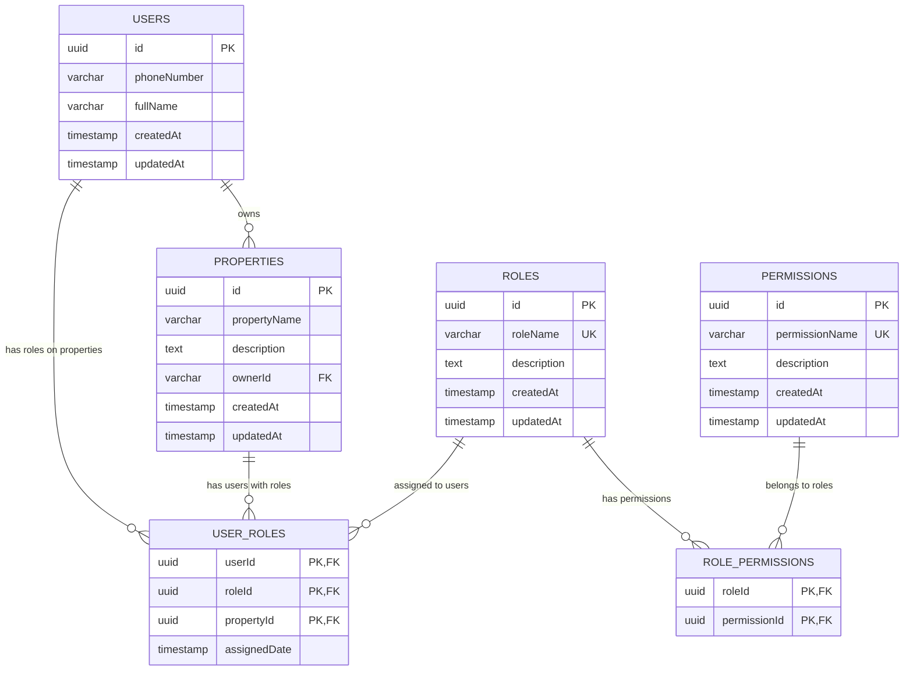
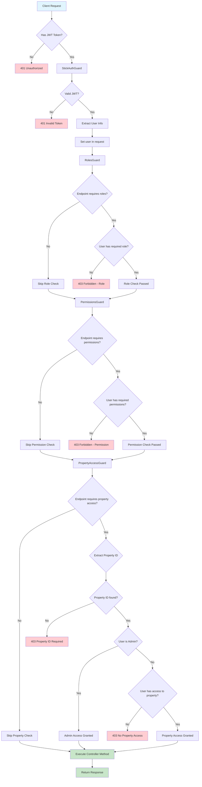
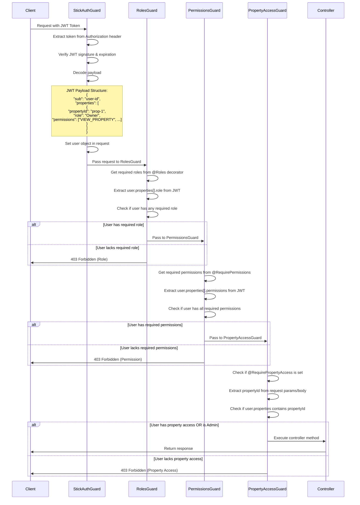
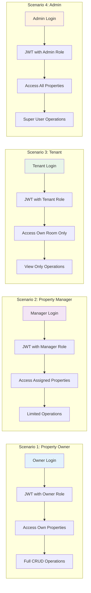
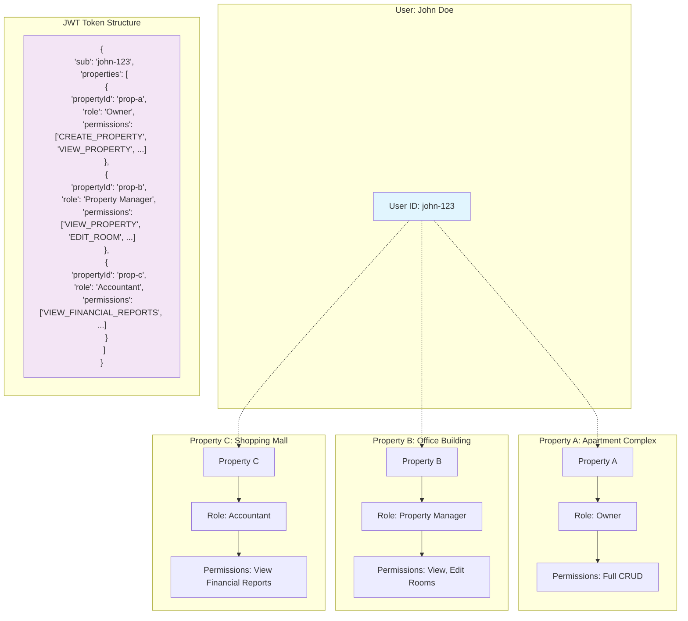

# Role-Based Access Control (RBAC) System Guide

## Tổng quan

Hệ thống RBAC (Role-Based Access Control) được thiết kế để quản lý quyền truy cập dựa trên vai trò người dùng trong ứng dụng quản lý phòng trọ. Hệ thống hỗ trợ multi-tenant architecture, cho phép một user có nhiều vai trò khác nhau trên các property khác nhau.

## Kiến trúc Database

### Database Relationship Diagram



### Database Schema

```sql
-- Bảng vai trò
CREATE TABLE "roles" (
  "id" uuid PRIMARY KEY DEFAULT uuid_generate_v4(),
  "roleName" varchar(100) UNIQUE NOT NULL,
  "description" text,
  "createdBy" varchar,
  "updatedBy" varchar,
  "createdAt" TIMESTAMP DEFAULT now(),
  "updatedAt" TIMESTAMP DEFAULT now()
);

-- Bảng quyền hạn
CREATE TABLE "permissions" (
  "id" uuid PRIMARY KEY DEFAULT uuid_generate_v4(),
  "permissionName" varchar(100) UNIQUE NOT NULL,
  "description" text,
  "createdBy" varchar,
  "updatedBy" varchar,
  "createdAt" TIMESTAMP DEFAULT now(),
  "updatedAt" TIMESTAMP DEFAULT now()
);

-- Bảng liên kết user-role-property (Multi-tenant)
CREATE TABLE "user_roles" (
  "userId" uuid NOT NULL,
  "roleId" uuid NOT NULL,
  "propertyId" uuid NOT NULL,
  "assignedDate" TIMESTAMP DEFAULT now(),
  PRIMARY KEY ("userId", "roleId", "propertyId"),
  FOREIGN KEY ("userId") REFERENCES "users"("id") ON DELETE CASCADE,
  FOREIGN KEY ("roleId") REFERENCES "roles"("id") ON DELETE CASCADE,
  FOREIGN KEY ("propertyId") REFERENCES "properties"("id") ON DELETE CASCADE
);

-- Bảng liên kết role-permission
CREATE TABLE "role_permissions" (
  "roleId" uuid NOT NULL,
  "permissionId" uuid NOT NULL,
  PRIMARY KEY ("roleId", "permissionId"),
  FOREIGN KEY ("roleId") REFERENCES "roles"("id") ON DELETE CASCADE,
  FOREIGN KEY ("permissionId") REFERENCES "permissions"("id") ON DELETE CASCADE
);
```

## Vai trò và Quyền hạn

### Định nghĩa Roles

```typescript
enum Role {
  ADMIN = 'Admin',
  OWNER = 'Owner',
  PROPERTY_MANAGER = 'Property Manager',
  ACCOUNTANT = 'Accountant',
  TENANT = 'Tenant',
}
```

### Định nghĩa Permissions

```typescript
enum Permission {
  // Property permissions
  CREATE_PROPERTY = 'CREATE_PROPERTY',
  VIEW_PROPERTY = 'VIEW_PROPERTY',
  EDIT_PROPERTY = 'EDIT_PROPERTY',
  DELETE_PROPERTY = 'DELETE_PROPERTY',

  // Room permissions
  CREATE_ROOM = 'CREATE_ROOM',
  VIEW_ROOM = 'VIEW_ROOM',
  EDIT_ROOM = 'EDIT_ROOM',
  DELETE_ROOM = 'DELETE_ROOM',

  // User management
  MANAGE_USERS = 'MANAGE_USERS',
  VIEW_USERS = 'VIEW_USERS',

  // Financial permissions
  VIEW_FINANCIAL_REPORTS = 'VIEW_FINANCIAL_REPORTS',
  MANAGE_PAYMENTS = 'MANAGE_PAYMENTS',
}
```

### Ma trận Quyền hạn

| Role                 | Property  | Room      | Users       | Financial    |
| -------------------- | --------- | --------- | ----------- | ------------ |
| **Admin**            | Full CRUD | Full CRUD | Full CRUD   | Full Access  |
| **Owner**            | Full CRUD | Full CRUD | View/Manage | Full Access  |
| **Property Manager** | View/Edit | Full CRUD | View        | View Reports |
| **Accountant**       | View      | View      | View        | Full Access  |
| **Tenant**           | View      | View      | -           | View Own     |

## Cấu trúc Code

### 1. Entities

#### Role Entity

```typescript
@Entity('roles')
export class Role extends BaseEntity {
  @Column({ type: 'varchar', length: 100, unique: true })
  roleName: string;

  @Column({ type: 'text', nullable: true })
  description: string;

  @OneToMany(() => UserRole, (userRole) => userRole.role)
  userRoles: UserRole[];

  @OneToMany(() => RolePermission, (rolePermission) => rolePermission.role)
  rolePermissions: RolePermission[];
}
```

#### Permission Entity

```typescript
@Entity('permissions')
export class Permission extends BaseEntity {
  @Column({ type: 'varchar', length: 100, unique: true })
  permissionName: string;

  @Column({ type: 'text', nullable: true })
  description: string;

  @OneToMany(
    () => RolePermission,
    (rolePermission) => rolePermission.permission,
  )
  rolePermissions: RolePermission[];
}
```

#### UserRole Entity (Multi-tenant)

```typescript
@Entity('user_roles')
export class UserRole {
  @PrimaryColumn()
  userId: string;

  @PrimaryColumn()
  roleId: string;

  @PrimaryColumn()
  propertyId: string;

  @Column({ type: 'timestamp', default: () => 'CURRENT_TIMESTAMP' })
  assignedDate: Date;

  @ManyToOne(() => User, (user) => user.userRoles, { onDelete: 'CASCADE' })
  user: User;

  @ManyToOne(() => Role, (role) => role.userRoles, { onDelete: 'CASCADE' })
  role: Role;

  @ManyToOne(() => Properties, (property) => property.userRoles, {
    onDelete: 'CASCADE',
  })
  property: Properties;
}
```

### 2. Guards System

#### Authentication Flow

```
Request → StickAuthGuard → RolesGuard → PermissionsGuard → PropertyAccessGuard → Controller
```

#### Detailed Authorization Flow Diagram



#### RolesGuard

```typescript
@Injectable()
export class RolesGuard implements CanActivate {
  constructor(private reflector: Reflector) {}

  async canActivate(context: ExecutionContext): Promise<boolean> {
    const requiredRoles = this.reflector.getAllAndOverride<Role[]>(ROLES_KEY, [
      context.getHandler(),
      context.getClass(),
    ]);

    if (!requiredRoles) return true;

    const { user } = context.switchToHttp().getRequest();
    if (!user) return false;

    const userProperties = user.properties || [];
    const userRoles = userProperties.map((property: any) => property.role);

    return requiredRoles.some((role) => userRoles.includes(role));
  }
}
```

#### PermissionsGuard

```typescript
@Injectable()
export class PermissionsGuard implements CanActivate {
  constructor(private reflector: Reflector) {}

  async canActivate(context: ExecutionContext): Promise<boolean> {
    const requiredPermissions = this.reflector.getAllAndOverride<Permission[]>(
      PERMISSIONS_KEY,
      [context.getHandler(), context.getClass()],
    );

    if (!requiredPermissions) return true;

    const { user } = context.switchToHttp().getRequest();
    if (!user) return false;

    const userProperties = user.properties || [];
    const userPermissions: string[] = [];

    userProperties.forEach((property: any) => {
      if (property.permissions) {
        userPermissions.push(...property.permissions);
      }
    });

    return requiredPermissions.every((permission) =>
      userPermissions.includes(permission),
    );
  }
}
```

#### PropertyAccessGuard

```typescript
@Injectable()
export class PropertyAccessGuard implements CanActivate {
  constructor(private reflector: Reflector) {}

  async canActivate(context: ExecutionContext): Promise<boolean> {
    const requirePropertyAccess = this.reflector.getAllAndOverride<boolean>(
      PROPERTY_ACCESS_KEY,
      [context.getHandler(), context.getClass()],
    );

    if (!requirePropertyAccess) return true;

    const request = context.switchToHttp().getRequest();
    const { user } = request;

    if (!user) return false;

    // Extract propertyId từ request
    const propertyId =
      request.params?.id ||
      request.params?.propertyId ||
      request.query?.propertyId ||
      request.body?.propertyId ||
      request.body?.id;

    if (!propertyId) {
      throw new ForbiddenException(
        'Property ID is required for this operation',
      );
    }

    const userProperties = user.properties || [];

    // Admin có quyền truy cập tất cả properties
    const isAdmin = userProperties.some(
      (property: any) => property.role === 'Admin',
    );

    if (isAdmin) return true;

    // Kiểm tra quyền truy cập property cụ thể
    const hasAccess = userProperties.some(
      (property: any) => property.propertyId === propertyId,
    );

    if (!hasAccess) {
      throw new ForbiddenException('You do not have access to this property');
    }

    return true;
  }
}
```

### 3. Decorators

#### @Roles Decorator

```typescript
export const ROLES_KEY = 'roles';
export const Roles = (...roles: Role[]) => SetMetadata(ROLES_KEY, roles);

// Usage
@Roles(Role.ADMIN, Role.OWNER)
@Get('sensitive-data')
async getSensitiveData() {
  // Chỉ Admin và Owner mới truy cập được
}
```

#### @RequirePermissions Decorator

```typescript
export const PERMISSIONS_KEY = 'permissions';
export const RequirePermissions = (...permissions: Permission[]) =>
  SetMetadata(PERMISSIONS_KEY, permissions);

// Usage
@RequirePermissions(Permission.VIEW_PROPERTY, Permission.EDIT_PROPERTY)
@Put(':id')
async updateProperty() {
  // Cần có cả 2 quyền VIEW_PROPERTY và EDIT_PROPERTY
}
```

#### @RequirePropertyAccess Decorator

```typescript
export const PROPERTY_ACCESS_KEY = 'propertyAccess';
export const RequirePropertyAccess = () =>
  SetMetadata(PROPERTY_ACCESS_KEY, true);

// Usage
@RequirePropertyAccess()
@Get(':id')
async getProperty(@Param('id') id: string) {
  // Kiểm tra user có quyền truy cập property này không
}
```

## JWT Token Structure

### JWT Token Processing Flow



### Token Payload

```json
{
  "sub": "user-uuid",
  "phoneNumber": "0123456789",
  "properties": [
    {
      "propertyId": "property-uuid-1",
      "role": "Owner",
      "permissions": [
        "CREATE_PROPERTY",
        "EDIT_PROPERTY",
        "VIEW_PROPERTY",
        "DELETE_PROPERTY"
      ]
    },
    {
      "propertyId": "property-uuid-2",
      "role": "Property Manager",
      "permissions": ["VIEW_PROPERTY", "EDIT_ROOM", "CREATE_ROOM"]
    }
  ],
  "iat": 1733613600,
  "exp": 1733620800
}
```

## Sử dụng trong Controller

### Real-world Usage Scenarios



### Multi-tenant Access Control Example



### Property Controller Example

```typescript
@Controller('api/property')
@UseGuards(StickAuthGaurd, RolesGuard, PermissionsGuard, PropertyAccessGuard)
export class PropertyController {
  @Get(':id')
  @Roles(
    Role.ADMIN,
    Role.OWNER,
    Role.PROPERTY_MANAGER,
    Role.ACCOUNTANT,
    Role.TENANT,
  )
  @RequirePermissions(Permission.VIEW_PROPERTY)
  @RequirePropertyAccess()
  async getProperty(@Param('id') id: string) {
    // Multi-layer security:
    // 1. User phải có một trong các roles được chỉ định
    // 2. User phải có permission VIEW_PROPERTY
    // 3. User phải có quyền truy cập property cụ thể này
    return this.propertyService.get(id);
  }

  @Put()
  @Roles(Role.ADMIN, Role.OWNER, Role.PROPERTY_MANAGER)
  @RequirePermissions(Permission.EDIT_PROPERTY)
  @RequirePropertyAccess()
  async updateProperty(@Body() dto: PropertyUpdateDto) {
    return this.propertyService.update(dto);
  }

  @Delete(':id')
  @Roles(Role.ADMIN, Role.OWNER)
  @RequirePermissions(Permission.DELETE_PROPERTY)
  @RequirePropertyAccess()
  async deleteProperty(@Param('id') id: string) {
    return this.propertyService.delete(id);
  }

  @Post()
  @Roles(Role.ADMIN, Role.OWNER)
  @RequirePermissions(Permission.CREATE_PROPERTY)
  // Không cần @RequirePropertyAccess() vì đang tạo mới
  async createProperty(@Body() dto: PropertyCreateDto) {
    return this.propertyService.create(dto);
  }
}
```

## RBAC Service

### Core Methods

```typescript
@Injectable()
export class RbacService {
  // Assign role to user for specific property
  async assignUserRole(
    userId: string,
    roleId: string,
    propertyId: string,
  ): Promise<void>;

  // Remove role from user for specific property
  async removeUserRole(
    userId: string,
    roleId: string,
    propertyId: string,
  ): Promise<void>;

  // Check if user has specific permission on property
  async hasPermission(
    userId: string,
    permission: string,
    propertyId: string,
  ): Promise<boolean>;

  // Generate user properties for JWT token
  async generateUserProperties(userId: string): Promise<UserProperty[]>;

  // Initialize default roles and permissions
  async initializeDefaultRolesAndPermissions(): Promise<void>;
}
```

## Security Features

### 1. Multi-Tenant Isolation

- Mỗi user chỉ có thể truy cập properties được assign
- Admin có quyền truy cập tất cả properties
- Property-level access control

### 2. Layered Security

- **Authentication**: JWT token validation
- **Authorization**: Role-based access
- **Permission**: Fine-grained permission control
- **Resource**: Property-specific access

### 3. Audit Trail

- Tất cả entities extend BaseEntity với `createdBy`, `updatedBy`
- Track assignment date trong UserRole
- Comprehensive logging

## Best Practices

### 1. Security

- ✅ Luôn validate JWT token
- ✅ Implement proper error handling
- ✅ Use HTTPS trong production
- ✅ Regular security audits

### 2. Performance

- ✅ Cache user permissions trong JWT
- ✅ Minimize database queries trong guards
- ✅ Use indexes trên foreign keys

### 3. Maintainability

- ✅ Centralized permission definitions
- ✅ Clear naming conventions
- ✅ Comprehensive documentation
- ✅ Unit tests cho guards

---

**Lưu ý:** Hệ thống RBAC này được thiết kế để scale với multi-tenant architecture và có thể mở rộng thêm roles/permissions khi cần thiết.
